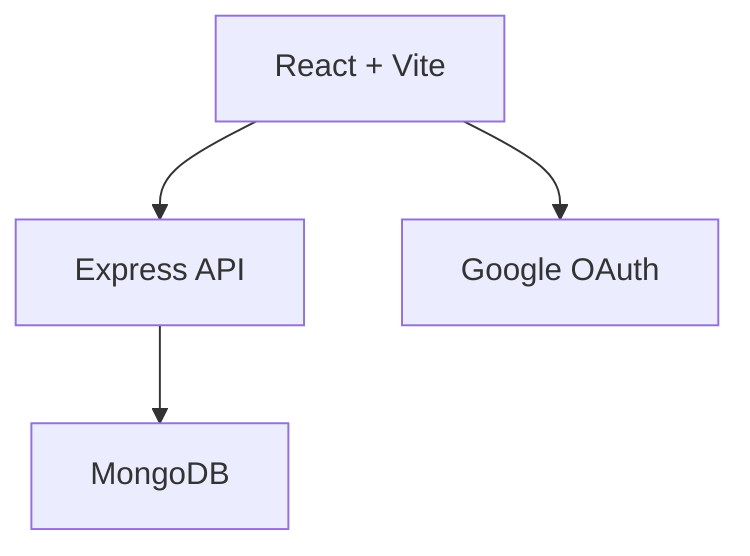

# ⌨️ DevType

<div align="center">

### Modern Developer-Focused Typing Platform

Practice typing with **real programming code**, improve speed, accuracy and coding muscle memory through an immersive experience.


</div>

> **DevType** is a developer-centric typing platform built for programmers who want to practice using actual code instead of random paragraphs.

---

# ✨ Features

- Multiple programming languages
- Difficulty levels
- Real-time WPM
- Accuracy tracking
- Error highlighting
- Google Authentication
- User profiles
- Responsive UI
- Modern animations

---

# 📸 Screenshots

Replace these with actual screenshots.

```
Landing Page
Practice Setup
Typing Interface
Results
Dashboard
```

---

# 🏗 Architecture



---

# 📂 Folder Structure

```text
DevType
│
├── client
│   ├── src
│   ├── components
│   ├── pages
│   └── assets
│
└── server
    ├── routes
    ├── controllers
    ├── models
    ├── middleware
    └── config
```

---

# ⚙️ Installation

```bash
git clone <repo-url>

cd DevType

npm install
```

Client

```bash
cd client
npm install
npm run dev
```

Server

```bash
cd server
npm install
npm start
```

---

# 🔐 Environment Variables

```env
MONGODB_URI=
GOOGLE_CLIENT_ID=
JWT_SECRET=
PORT=
```

---

# 💻 Tech Stack

| Frontend | Backend | Database | Auth |
|-----------|----------|----------|------|
| React | Express | MongoDB | Google OAuth |
| Tailwind CSS | Node.js | Mongoose | JWT |

---

# ⌨️ Typing Engine

The typing engine validates every keystroke in real time.

Metrics calculated:

- WPM
- Accuracy
- Total Errors
- Correct Characters
- Incorrect Characters
- Completion Time

---

# 🚀 Why DevType?

Unlike traditional typing websites that rely on generic text passages, DevType focuses on programming-oriented content. Users improve both typing speed and familiarity with real-world coding syntax.

---

# 📈 Future Roadmap

- Multiplayer typing races
- Friends system
- Leaderboards
- Daily challenges
- Custom snippets
- VS mode
- Themes
- Achievements

---

# 🧠 Challenges

- Real-time validation
- Accurate WPM calculations
- State synchronization
- Authentication flow
- Responsive interface

---

# 🤝 Contributing

1. Fork the repository
2. Create a feature branch
3. Commit your changes
4. Open a Pull Request

---

# 📜 License

MIT License

---

# 👨‍💻 Authors

**RockY010101**
**Abhixarvar**

If you found this project useful, consider giving it a ⭐ on GitHub.
